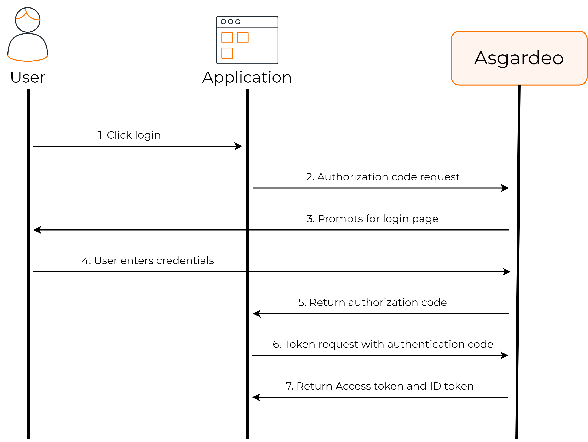

# Description

Here demonstrates the "OAuth2 standard flow / Authorization code grant flow"

## Key-cloak configuration

* Create a new realm (or use an existing realm)
* Create a client
   * give a client id
   * give a redirect url, http://localhost:8080/login/oauth2/code/spring-demo-client
      * format: {baseUrl}/login/oauth2/code/{clientId}
      * this "clientId" should be used in the application properties file in spring application later
   * Client Authentication = ON ==> this is a confidential client, not a public client
   * Authentication flow = Standard flow
* Create a User and create a password for this user (or you may use existing users of this realm)

## Usage

 * run the spring application
 * go to "http://localhost:8080/home"
 * you will be redirect to a login page
 * enter user and password details which you created in keycloak
 * after successful login, you will be redirected to the home page
